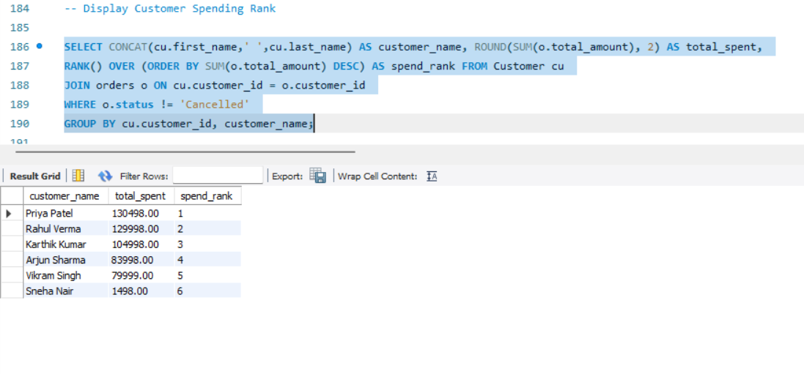
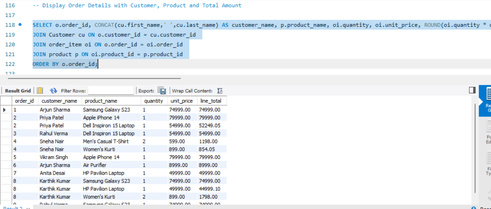

# Retail Sales & Inventory Management System (MySQL)

## Overview

A relational database project built using MySQL to manage and analyze retail sales and inventory data. The project demonstrates database design, table relationships, data insertion, and analytical SQL queries to generate business insights.

## Database Features

- Customer Management
- Product Management
- Order Tracking
- Sales Analysis
- Inventory Monitoring
- Revenue Analysis
- Customer Spending Ranking
- Monthly Sales Analysis

## Database Tables

- Customer
- Product
- Orders
- Order Details
- Inventory
- Category
- Supplier

## SQL Concepts Used

- Database Creation
- Table Creation
- Primary Keys & Foreign Keys
- Data Insertion
- Joins
- Aggregate Functions
- GROUP BY
- Subqueries
- Views
- Window Functions
- Ranking Analysis

## Tools Used

- MySQL
- MySQL Workbench

## Project File

Retail_Sales_and_Inventory_Management_System.sql

## Project Preview

### Customer Spending Analysis

### Order Details Analysis

## Author

Sahara Rampal
